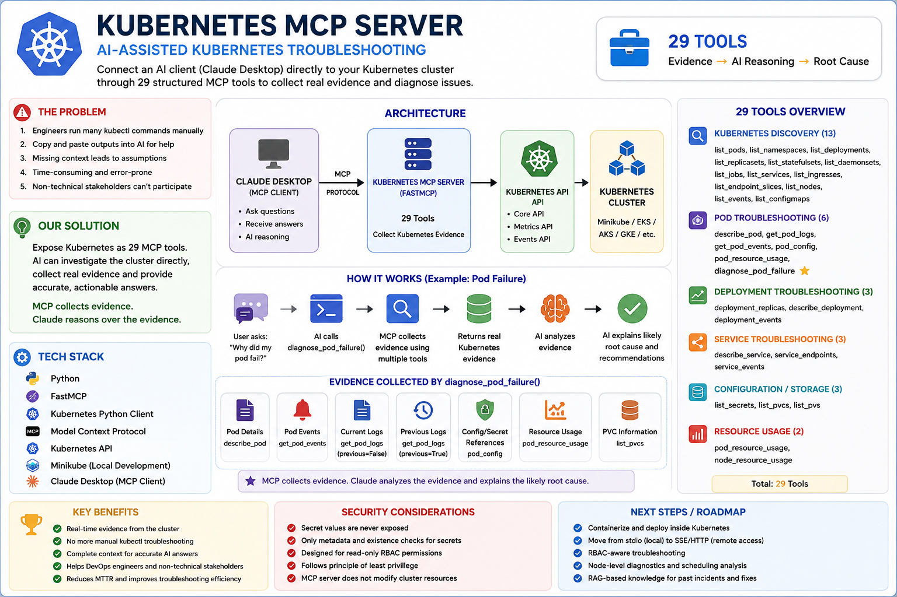

# Kubernetes MCP Server — AI-Assisted Troubleshooting

A custom **Model Context Protocol (MCP) server** built with Python, FastMCP, and the Kubernetes Python Client. It connects an MCP-compatible AI client (like Claude Desktop) directly to a Kubernetes cluster through a controlled set of tools — enabling **AI-assisted diagnosis** of cluster issues instead of manual, error-prone troubleshooting.

## Problem

Traditional Kubernetes troubleshooting looks like this:

1. Engineer manually runs several `kubectl` commands — `get pods`, `describe pod`, `logs`, `logs --previous`, checks ConfigMaps/Secrets
2. Copies output and pastes it into an AI assistant for help
3. If any piece of context is missed or forgotten, the AI has to **assume** — leading to unreliable, guess-based answers
4. Non-DevOps stakeholders (managers, product owners) can't participate at all — they'd need `kubectl` installed and command knowledge just to ask "how many pods are running?"

## Solution

This MCP server exposes the Kubernetes API as a set of structured tools an AI can call **directly and automatically**. Instead of the human gathering evidence and handing it to the AI, the AI investigates the cluster itself — pulling logs, events, config references, and resource usage — and returns a **root-cause diagnosis**, not a guess.

This turns:

> "Here's my pod's logs, description, and configmap... why did it fail?"

into simply:

> "Why did my pod fail?"

...with the AI doing the investigation autonomously via MCP tools.

It also opens the door for **non-technical stakeholders** to query cluster state in plain English without ever touching `kubectl`.

## Architecture


```
Claude Desktop (MCP client)
        |
        | MCP Protocol
        v
Kubernetes MCP Server (FastMCP) — 29 tools
        |
        | Kubernetes API (core / events / metrics)
        v
Minikube / EKS / AKS / GKE cluster
```


**How it works — example (pod failure):**

```
User asks "why did my pod fail?"
        v
AI calls diagnose_pod_failure()
        v
MCP collects evidence using multiple tools:
  - Pod details (describe_pod)
  - Pod events (get_pod_events)
  - Current logs (get_pod_logs, previous=False)
  - Previous logs (get_pod_logs, previous=True)
  - Config/secret references (pod_config)
  - Resource usage (pod_resource_usage)
        v
Returns combined evidence from the cluster
        v
AI analyzes the evidence and explains the likely root cause
```

MCP collects evidence — Claude reasons over the evidence and explains the root cause.

## Tool Coverage — 29 Tools

### Discovery
`list_pods` · `list_namespaces` · `list_deployments` · `list_replicasets` · `list_statefulsets` · `list_daemonsets` · `list_jobs` · `list_services` · `list_ingresses` · `list_endpointslices` · `list_nodes` · `list_events` · `list_configmaps`

### Pod Troubleshooting
| Tool | Purpose |
|---|---|
| `describe_pod` | Full pod status, container states, and recent events |
| `get_pod_logs` | Logs from a pod — supports **current and previous** container instances (critical for CrashLoopBackOff, where the current log is often empty right after a restart) |
| `get_pod_events` | Kubernetes events scoped to a specific pod |
| `pod_config` | Checks which ConfigMaps/Secrets a pod references and whether they actually exist (existence-only — secret values are never exposed) |
| `pod_resource_usage` | CPU/memory usage vs. configured limits — key for diagnosing OOMKilled |
| `diagnose_pod_failure` ⭐ | **Orchestration tool** — combines describe, current + previous logs, events, and config checks into a single root-cause report |

### Deployment Troubleshooting
`deployment_replicas` · `describe_deployment` · `deployment_events`

### Service Troubleshooting
`describe_service` · `service_endpoints` · `service_events`

### Configuration / Storage
`list_secrets` (existence-only) · `list_pvcs` · `list_pvs`

### Resource Usage
`pod_resource_usage` · `node_resource_usage`

## Example Flow

```
User: "Why did my payment-service pod fail?"

AI calls diagnose_pod_failure(namespace="prod", pod_name="payment-service-xyz")
  → describe_pod reveals: CrashLoopBackOff, restart count 8
  → get_pod_logs(previous=True) reveals: "OOMKilled" in app logs
  → pod_resource_usage shows: memory limit 128Mi, actual usage spiking to 250Mi+
  → pod_config confirms all referenced ConfigMaps/Secrets exist

AI Response: "The pod was OOMKilled — memory limit is set to 128Mi but the 
application requires significantly more under load. Recommend raising the 
memory limit to at least 256-512Mi and monitoring actual usage after the change."
```

No missing context. No assumptions. A single question, a complete answer.

## Key Benefits

- Real-time evidence pulled directly from the live cluster, not stale copy-pasted output
- No more manual `kubectl` troubleshooting for common failure patterns
- Complete context for accurate AI answers — no missing details, no assumptions
- Helps both DevOps engineers and non-technical stakeholders query cluster state
- Reduces mean time to resolution (MTTR) and improves troubleshooting efficiency

## Security Considerations

- Secret values are never exposed — only existence and reference validity are checked
- Only metadata and existence checks are returned for Secrets, never contents
- Designed for **read-only RBAC permissions** when deployed inside a cluster
- Follows the principle of least privilege
- The MCP server does not modify cluster resources — read-only by design
- Tool exposure can be split by audience: full troubleshooting toolset for engineers, minimal read-only subset (e.g. `list_pods`, `deployment_replicas`) for non-technical stakeholders

## Tech Stack

- **Python**
- **FastMCP** (Model Context Protocol server framework)
- **Kubernetes Python Client**
- **Minikube** (local development cluster)

## Next Steps / Roadmap

- [ ] Containerize and deploy inside Kubernetes
- [ ] Move from stdio (local) to SSE/HTTP (remote access)
- [ ] RBAC-aware troubleshooting (service account / role binding checks) for permission-related failures
- [ ] Node-level diagnostics and scheduling analysis (`describe_node`, node events) for `Pending` pods caused by taints/resource pressure
- [ ] RAG-based knowledge layer for past incidents and fixes — augment diagnoses with a knowledge base of common patterns

## Author

Built by [Mahesh Kuruva](https://github.com/pkmaheshvk18) as a hands-on project combining Kubernetes administration (CKA prep) with AI-assisted operations tooling.